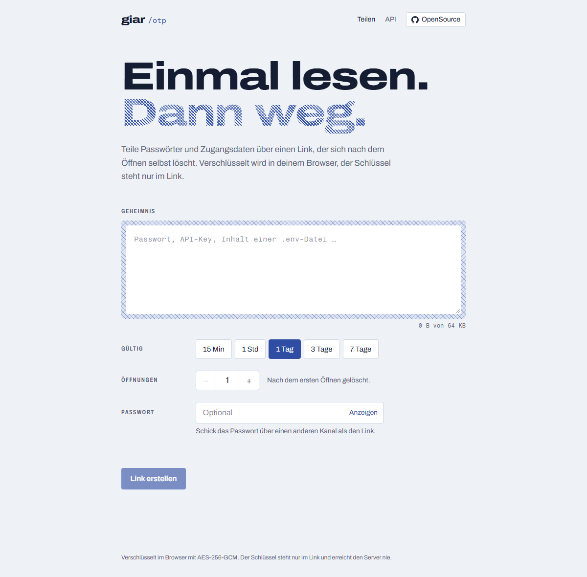
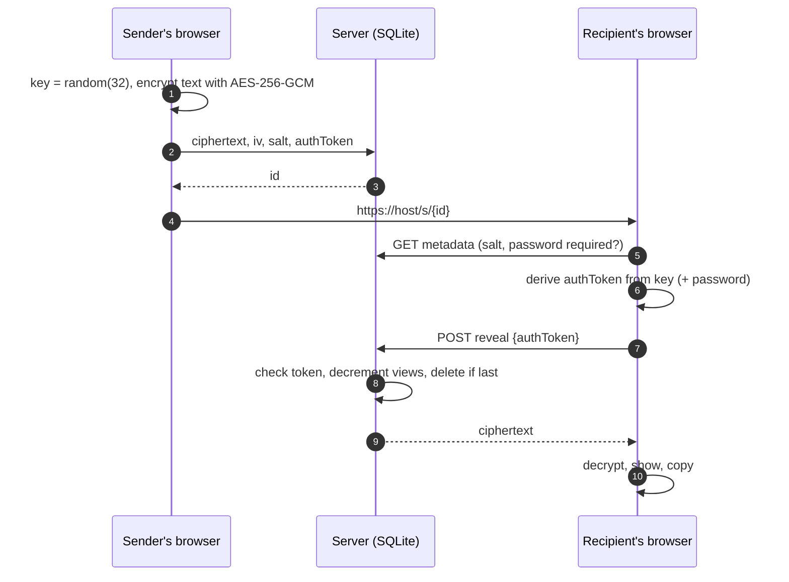

<div align="center">

# giar otp

**Share passwords, API keys and credentials through a link that destroys itself after reading.**
End-to-end encrypted in the browser. The server never sees the key.

[](LICENSE)
[](https://svelte.dev)
[](https://nodejs.org)
[](https://nodejs.org/api/sqlite.html)

[Live instance](https://otp.giar.digital) · [API docs](https://otp.giar.digital/docs) · [OpenAPI](https://otp.giar.digital/api/v1/openapi.json) · [Self-hosting](#self-hosting)

<picture>
  <source media="(prefers-color-scheme: dark)" srcset=".github/assets/create-dark.png">
  
</picture>

</div>

## Why

Passwords end up in chat histories, tickets and inboxes, where they stay forever. giar otp turns a secret into a link that works once (or a few times), expires after at most 7 days and is encrypted before it leaves your browser.

- **End-to-end encrypted.** AES-256-GCM in the browser via WebCrypto. The key lives only in the URL fragment (`#…`), which browsers never send to a server.
- **Self-destructing.** Choose 1–100 views and a lifetime from 1 minute to 7 days. Opened and expired secrets are deleted immediately.
- **Optional password** on top of the link. Wrong passwords don't consume a view; after 10 failed attempts the secret is destroyed.
- **Unguessable links.** 192-bit random IDs plus a 256-bit key. Knowing the ID alone (e.g. from a server log) is not enough to read a secret or use up its views.
- **Safe with link previews.** Slack, Teams or WhatsApp unfurling a link doesn't open it. Only the explicit click does.
- **Developer API.** REST API with OpenAPI spec, SDKs for JavaScript/TypeScript and Python, and a CLI for CI/CD pipelines.
- **Boring to run.** One Node process, one SQLite file, no native dependencies, no external services. Fonts are self-hosted; no third-party requests.

<picture>
  <source media="(prefers-color-scheme: dark)" srcset=".github/assets/open-dark.png">
  
</picture>

## How it works



Protocol v1 (single source of truth: [`sdks/js/src/crypto.ts`](sdks/js/src/crypto.ts)):

```
key        = 32 random bytes                         → only in the link, after #
salt, iv   = 16 / 12 random bytes
ikm        = key                                     (no password)
           = key ‖ PBKDF2-SHA256(password, salt, 600 000)
encKey     = HKDF-SHA256(ikm, salt, "otp-giar:v1:enc")
authToken  = HKDF-SHA256(ikm, salt, "otp-giar:v1:auth")
ciphertext = AES-256-GCM(encKey, iv, text, aad = "otp-giar:v1")
```

The server stores `ciphertext`, `iv`, `salt` and `SHA-256(authToken)` – nothing that can decrypt the secret.

### Security notes

- **Trust in the served code.** Like every web-based E2E tool, you trust the instance to serve honest JavaScript. For maximum assurance, self-host or use an SDK/CLI, which encrypt locally.
- **Plain-text API mode.** For quick `curl` usage the API also accepts plain text and encrypts server-side. The server then sees the secret briefly in memory. The web app, the SDKs and the CLI never use this mode.
- **Fail closed.** 10 wrong link/password attempts destroy a secret, so someone who knows only the ID can delete it (but never read it). Reveal requests are rate-limited per IP.
- **Rate limits are in memory** and per process. Run a single instance.
- Security headers include a strict CSP (nonce-based scripts), `frame-ancestors 'none'`, `Referrer-Policy: no-referrer` and `Cache-Control: no-store` on secret pages and the API. SQLite runs with `secure_delete`.

Found a vulnerability? See [SECURITY.md](SECURITY.md).

## Self-hosting

### Docker Compose

```sh
git clone https://github.com/thegiommi/otp-giar.git && cd otp-giar
ORIGIN=https://otp.example.com docker compose up -d
```

The database lives in the `otp-data` volume. Put a reverse proxy with TLS in front (Caddy, Traefik, nginx).

### Docker

```sh
docker build -t otp-giar .
docker run -d -p 3000:3000 -v otp-data:/data -e ORIGIN=https://otp.example.com otp-giar
```

### Node

```sh
npm ci && npm run build
ORIGIN=https://otp.example.com npm start
```

### Configuration

| Variable | Default | |
| --- | --- | --- |
| `ORIGIN` | – | Public URL, e.g. `https://otp.example.com`. Required in production. |
| `DATABASE_PATH` | `data/otp.sqlite` (`/data/otp.sqlite` in Docker) | SQLite file. Keep it on a persistent volume. |
| `PORT` | `3000` | |
| `ADDRESS_HEADER` / `XFF_DEPTH` | – | Behind a reverse proxy set to `X-Forwarded-For` / `1`, so rate limits see the real client IP. |

Needs a long-running Node process (not serverless). Works well on Coolify, Dokku, a plain VPS or any container host.

### API keys

API keys are optional and raise the rate limit for creating secrets (20 → 1000 per 10 minutes).

```sh
npm run apikey -- create "GitHub Actions"   # prints the key once
npm run apikey -- list
npm run apikey -- revoke <id>
# in Docker: docker exec <container> npm run apikey -- create "GitHub Actions"
```

## API & SDKs

Full reference: `/docs` on any instance, machine-readable at `/api/v1/openapi.json`.

| | Endpoint | |
| --- | --- | --- |
| `POST` | `/api/v1/secrets` | Create a secret |
| `GET` | `/api/v1/secrets/{id}` | Metadata, does not consume a view |
| `POST` | `/api/v1/secrets/{id}/reveal` | Open, consumes one view |
| `DELETE` | `/api/v1/secrets/{id}` | Burn early (`X-Delete-Token` header) |

**curl** (plain-text mode)

```sh
curl -s -X POST https://otp.giar.digital/api/v1/secrets \
  -H 'Content-Type: application/json' \
  -d '{"secret": "DB_PASSWORD=hunter2", "expiresIn": 3600, "maxViews": 1}'
```

**JavaScript / TypeScript** – [`sdks/js`](sdks/js), zero dependencies, Node ≥ 20, Deno, Bun, browsers

```ts
import { OtpClient } from '@giar/otp';

const otp = new OtpClient({ baseUrl: 'https://otp.giar.digital' });
const { link } = await otp.create('DB_PASSWORD=hunter2', { expiresIn: 3600, maxViews: 1 });
const { secret } = await otp.reveal(link);
```

**Python** – [`sdks/python`](sdks/python), depends only on `cryptography`

```python
from otp_giar import OtpClient

otp = OtpClient("https://otp.giar.digital")
created = otp.create("DB_PASSWORD=hunter2", expires_in=3600, max_views=1)
print(otp.reveal(created.link).secret)
```

**CLI** for CI/CD – secrets come from stdin, passwords from an environment variable, never from arguments

```sh
pip install "git+https://github.com/thegiommi/otp-giar#subdirectory=sdks/python"
export OTP_BASE_URL=https://otp.giar.digital
printf '%s' "$STAGING_PASSWORD" | otp-giar create --ttl 1d --views 1
otp-giar reveal "https://otp.giar.digital/s/<id>#<key>"
```

> The packages are not on npm/PyPI yet. Until then install the Python SDK from Git as shown above, or build the JS SDK with `npm run build` in `sdks/js`.

The web app, the JS SDK and the Python SDK are tested against each other: a secret created by any of them opens in any other.

## Development

```sh
npm install
npm run dev          # http://localhost:5173
npm run check        # svelte-check / TypeScript

# end-to-end tests against a running instance
OTP_BASE_URL=http://localhost:5173 npm run test:e2e
OTP_BASE_URL=http://localhost:5173 python -m unittest discover -s sdks/python/tests
```

```
src/routes/+page.svelte         create a secret
src/routes/s/[id]/              open a secret
src/routes/docs/                API documentation
src/routes/api/v1/              REST API
src/lib/server/secrets.ts       create / reveal / burn / expiry
src/lib/server/database.ts      schema and migrations (node:sqlite)
src/hooks.server.ts             security headers, CORS, purge job
sdks/js/src/crypto.ts           encryption protocol, shared by web app and JS SDK
sdks/js/, sdks/python/          SDKs and CLIs
```

Built with SvelteKit 2 / Svelte 5, Tailwind CSS 4, Archivo and Fragment Mono. The UI is in German for now; translations are welcome.

## Contributing

Issues and pull requests are welcome. Please keep the protocol in `sdks/js/src/crypto.ts` and `sdks/python/otp_giar/__init__.py` in sync and run both test suites before opening a PR.

## License

[MIT](LICENSE) © GIAR Digital
